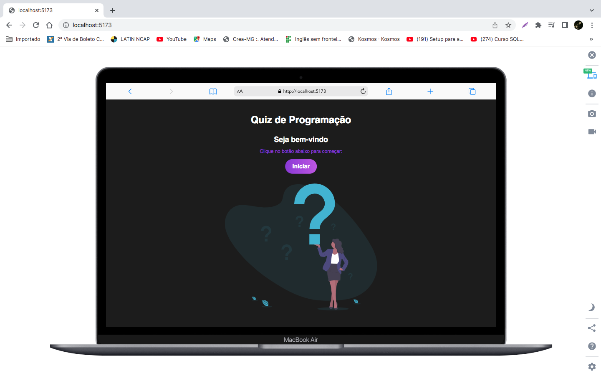

# Quiz_React-App
<p align="center">
  <a href="#dart-about">About</a> &#xa0; | &#xa0; 
  <a href="#sparkles-features">Features</a> &#xa0; | &#xa0;
  <a href="#rocket-technologies">Technologies</a> &#xa0; | &#xa0;
  <a href="#white_check_mark-requirements">Requirements</a> &#xa0; | &#xa0;
  <a href="#checkered_flag-starting">Starting</a> &#xa0; | &#xa0;
  <a href="https://github.com/chagasleandro" target="_blank">Author</a>&#xa0; | &#xa0
  <a href="https://disney-plus-clone-chi.vercel.app/" target="_blank" rel="noopener noreferrer">Projeto</a>
</p>

<br>

<p align="center">
 

  
</p>

## :dart: About ##
Com este mini-projeto você poderá praticar os seus conhecimentos de Reactjs com HTML, CSS e Javascript, projeto de Quiz de programação onde o usuário poderá escolher seu tema no jogo. 


<br/><br/>

## :rocket: Technologies ##

The following tools were used in this project:

- [React](https://pt-br.reactjs.org/)
- [JavaScript](https://developer.mozilla.org/pt-BR/docs/Web/JavaScript) 
- [Html](https://developer.mozilla.org/pt-BR/docs/Web/HTML/Element/html/)  
- [CSS](https://developer.mozilla.org/pt-BR/docs/Web/CSS)

## :white_check_mark: Requirements ##

Before starting :checkered_flag:, you need to have [Git](https://git-scm.com) and [Node](https://nodejs.org/en/) installed.

## :checkered_flag: Starting ##

```bash
# Clone this project
$ git clone https://github.com/chagasleandro/Quiz_React-App.git
# Access
$ cd Quiz_React-App
# Install dependencies
$ yarn or npm 
# Run the project
$ npm run dev
# The server will initialize in the <http://localhost:5173>
